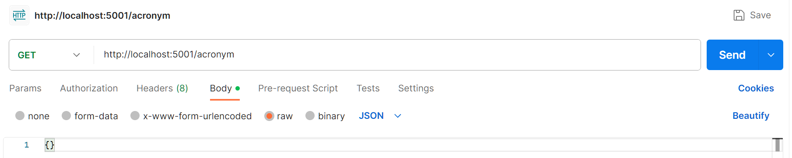
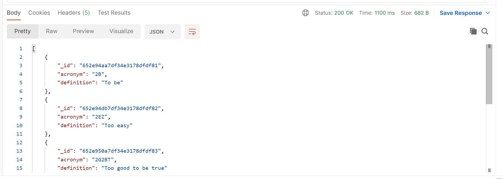
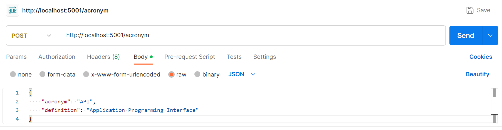
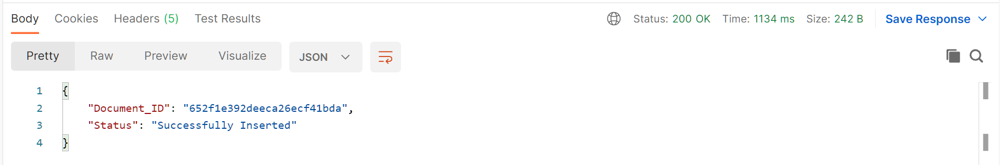
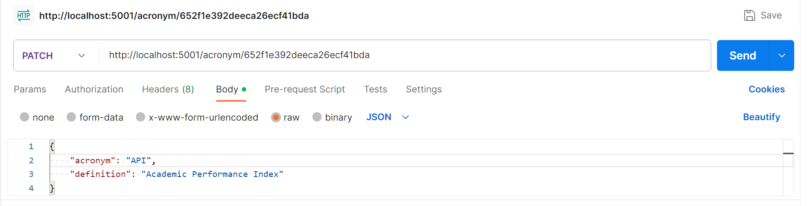
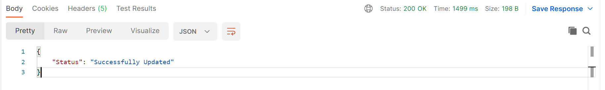
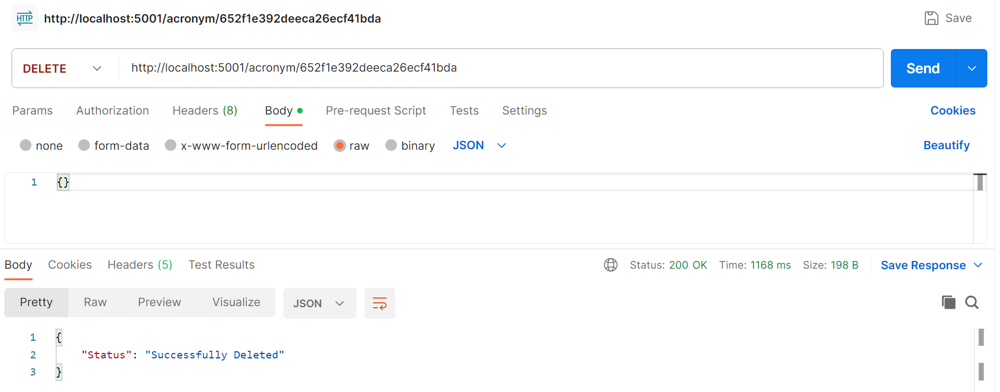

# REST API Server for acronyms (Flask & MongoDB)

## Introduction

    This is a toy project to demonstrate how to setup a simple local REST API server using Flask and an online mongoDB database to store acronyms.
    The API server supports the following methods:
        • GET /acronym - returns a list of acronyms
        • POST /acronym - adds the acronym definition to the db
        • PATCH /acronym/<acronymID> - updates the acronym for <acronymID>
        • DELETE /acronym/<acronymID> - deletes the acronym for <acronymID>

    For the mongoDB database, user can add your own local database or access to the author's online database (hosted in personal Cloud Atlas' account)there is only one "acronyms" collection to be used. There are two users that have different roles for the database:
        • acronymAdmin - has full access to the database (_password is not given_)
        • acronymReader - has read-only access to the database


 ## Requirements
 
    • Python 3+
    • Flask
    • PyMongo
    • MongoDB / Mongo Shell / Compass
    • MongoDB Atlas (optional)
    • Postman (Optional, to validate the API calls)
    

 ## Installation
 
    • Clone the repository
    • Create a virtual environment and activate it
    • Install the requirements:
        Run the following command from command line (Windows) or terminal (Linux/Mac) at the project's repository:

            ``` 
            pip install -r requirements.txt
            ```

 ## Running the server
    • Change the connection string in the "acronym_MongoDB_API.py" file to your own mongoDB connection string

    • Run the server in read-only mode (default) following command:
        ```
        python acronym_MongoDB_API.py
        ```

    • Run the server in admin mode (default) following command:
        ```
        python acronym_MongoDB_API.py -a -p <AdminPassword>
        ```
    
        If `<AdminPassword>` is not given, user will need to manually enter the password in the command line as requested.

## Some examples using Postman

1. Get all acronyms (GET method):

    • Send a GET request to http://localhost:5001/acronym:
        

    • Response (assumed using default read-only mode or admin mode with correct password provided):
        


2.   Add a new acronym (POST method) - assumed using admin mode and the correct <AdminPassword> was provided:

    • Send a POST request to http://localhost:5001/acronym with the following body (in JSON format):
        ```
        {
            "acronym": "API",
            "definition": "Application Programming Interface"
        }
        ```

        

    • Response:
        

3.   Update an acronym (PATCH method) - assumed using admin mode and the correct <AdminPassword> was provided:

    • Send a PATCH request to http://localhost:5001/acronym/652f1e392deeca26ecf41bda with the following body (in JSON format):

    ```
    {
        "acronym": "API",
        "definition": "Academic Performance Index"
    }
    ```

    

    • Response:

        

4.  Delete an acronym (DELETE method) - assumed using admin mode and the correct <AdminPassword> was provided:

    • Send a DELETE request to http://localhost:5001/acronym/652f1e392deeca26ecf41bda:
        
